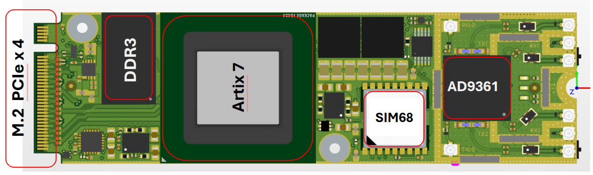
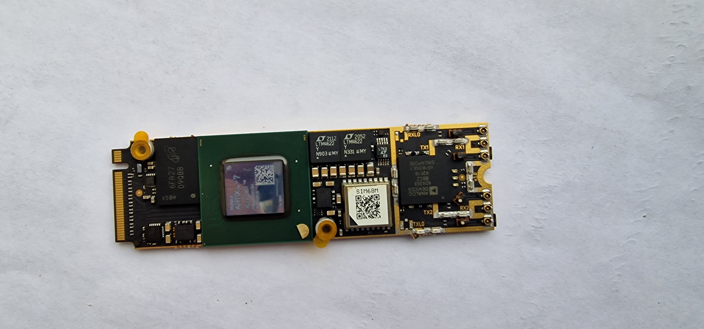
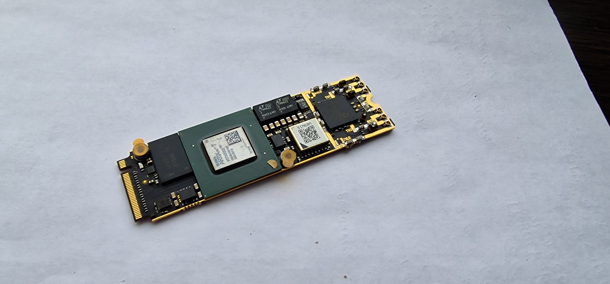
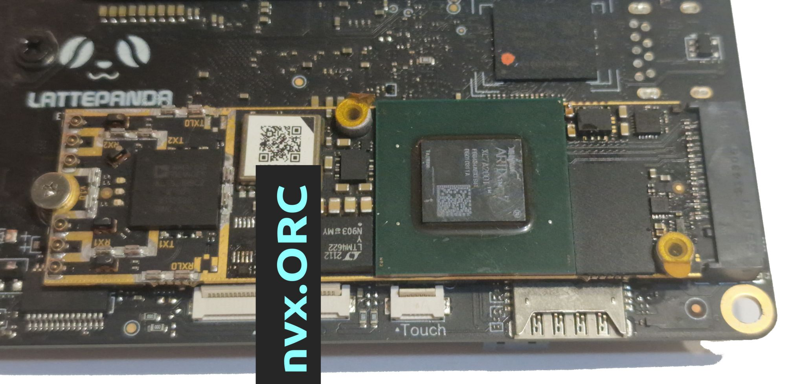

# nvx.orc-a6x

**Compact open-source SDR board with Artix-7, PCIe, GPS, MEMS, and DDR3 — by Novexum™**

---

## 🔍 Overview

**nvx.orc-a6x** is a high-performance software-defined radio (SDR) platform based on the AMD Artix-7 FPGA and AD936x RFIC transceiver.  
It features M.2 PCIe connectivity, 10-axis motion sensing (MEMS), multi-GNSS (GPS/GLONASS), and DDR3 memory — all in a 22x80mm form factor.

> 🛠️ **nvx.orc-a6x is part of the [Open Hardware Movement](https://www.oshwa.org/definition/)**  
> All hardware design files will be released under open licenses for modification, reproduction, and educational use.

This repository contains the hardware design files, FPGA firmware, drivers, and documentation.

---

## 🖼️ Visuals

### 📐 Board Render

### 📷 Real-world Photos

**Top View**  

**Angled View**  

**Mounted on Dev Board**  

## 📂 Repository Structure

- `hardware/` – schematics, PCB layout, BOM (KiCad)
- `firmware/` – Verilog HDL, XDC constraints
- `software/` – PCIe interface tools, test scripts, drivers
- `docs/` – datasheets, diagrams, integration notes
- `branding/` – logo assets and usage rules
- `TRADEMARK.md` – trademark policy for Novexum™ identity

---

## 🔧 Key Features

- 🎛️ **FPGA**: AMD Artix-7 (XC7A75T / XC7A100T / XC7A200T)  
- 📶 **RFIC**: Analog Devices AD9361 / AD9363 wideband transceiver  
- 🧩 **Form Factor**: M.2 2280 Key-M with PCIe Gen2 x4 interface  
- 📡 **Antenna Ports**: 5× U.FL connectors  
  - 2× TX/RX (2T2R MIMO)  
  - 1× GNSS  
  - 1× Reference Clock In (W.FL)  
  - 1× Reference Clock Out (W.FL)  
- 🛰️ **GNSS**: GPS / GLONASS receiver with 3.3 V bias for active antennas  
- 🧭 **Motion Sensor**: 10-axis MEMS IMU  
  - 3-axis accelerometer  
  - 3-axis gyroscope  
  - 3-axis magnetometer  
  - onboard temperature sensor  
- 🌬️ **Barometric Sensor**: Bosch BMP280 for pressure and altitude estimation  
- 🧠 **Memory**: DDR3 for local buffering and real-time signal processing  
- 🔌 **Clock Sync**: External reference input/output (10 MHz / 40 MHz, W.FL-compatible)

---

## 🚀 Use Cases

- Embedded SDR computing
- Spectrum analysis and monitoring
- Mobile device detection
- Wireless protocol prototyping
- Position-aware RF sensing systems

---

## 📜 License

This repository is released under the **Apache License 2.0**.  
See [`LICENSE`](./LICENSE) for full terms.

> ⚠️ The names **Novexum**, **nvx.orc**, and the Novexum™ logo are trademarks. See [`TRADEMARK.md`](./TRADEMARK.md) for permitted and prohibited use.

---

## 👤 About

Developed by [Konstantin Tiutin](https://www.linkedin.com/in/konstantin-tyutin/),  
founder of **Novexum™** — building open hardware for RF, embedded AI, and signal intelligence.

More at: [https://nvxorc.com](https://nvxorc.com)

---

## 📦 Status

🟢 Early access — initial hardware and HDL files coming soon  
📢 Want to contribute, integrate, or test? Reach out!
